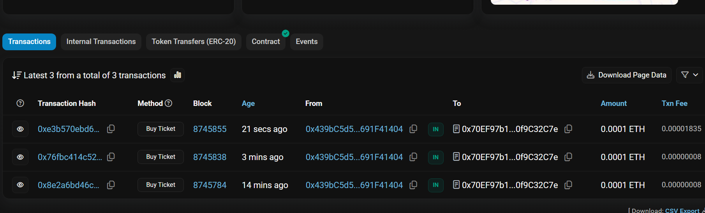
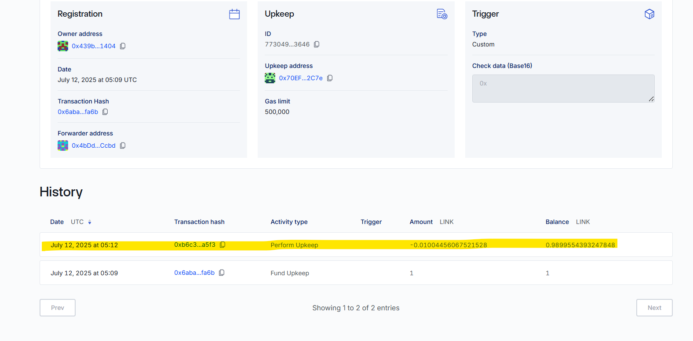
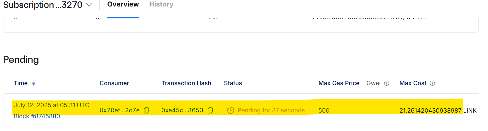
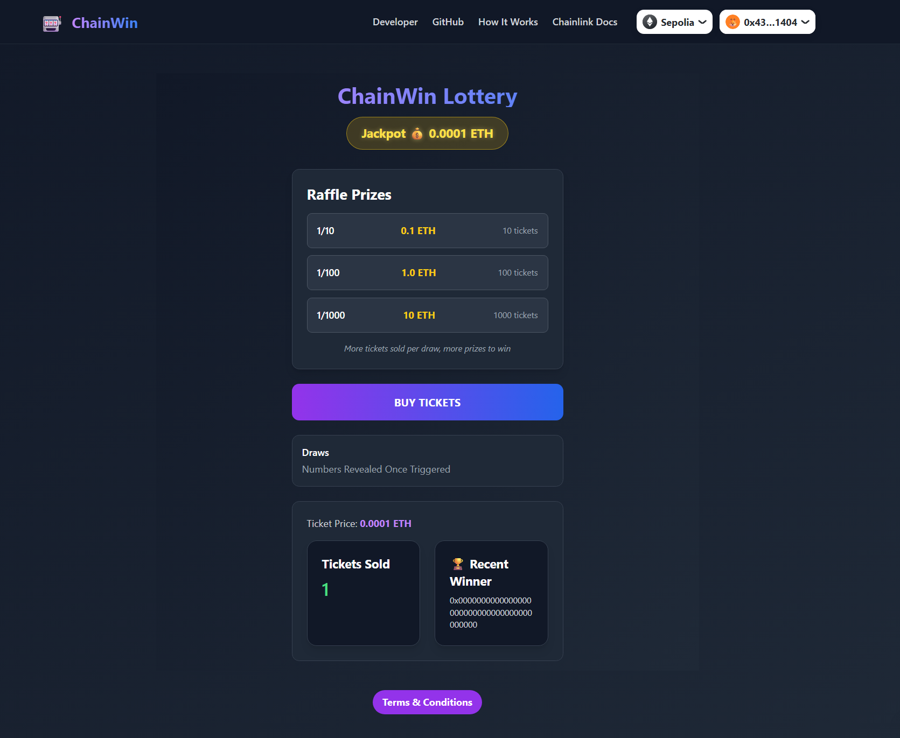
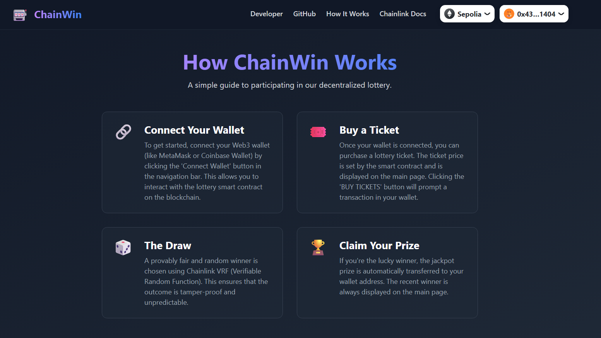
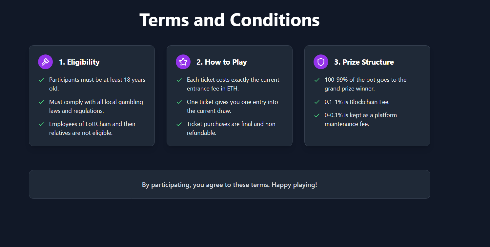
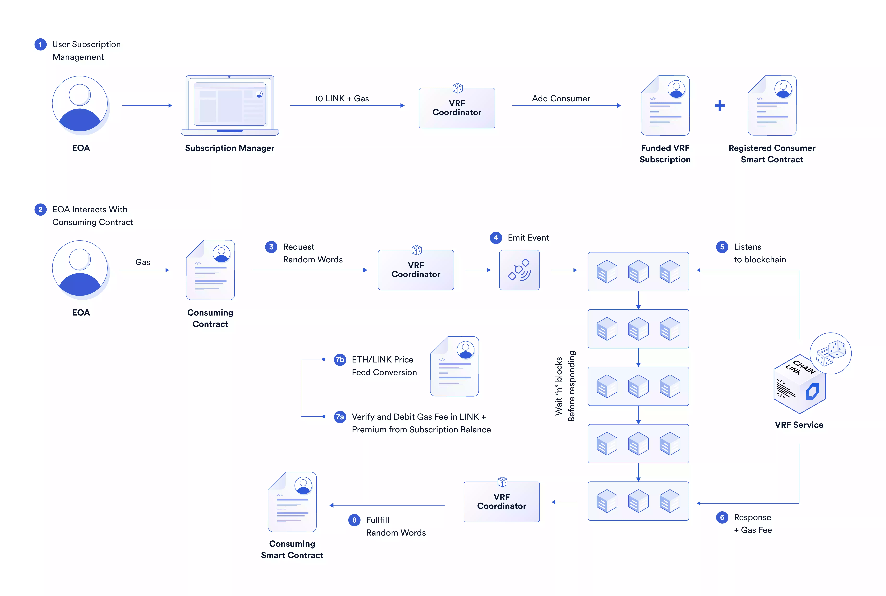
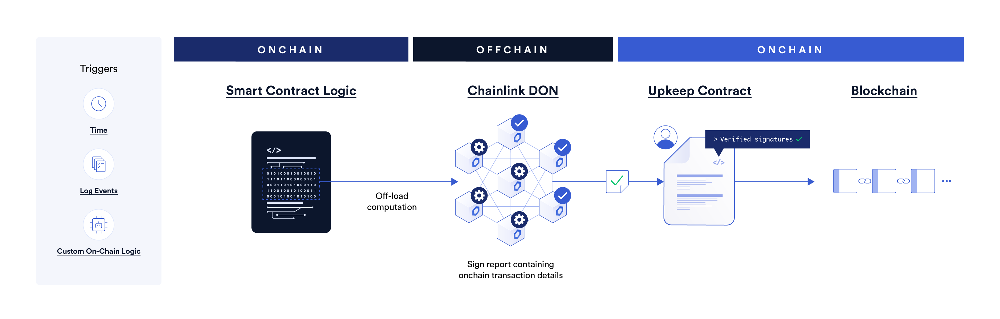

# 🎟️ Decentralized Lottery DApp

> 🟢 **Live Demo Deployed at:** [https://imaginative-creponne-075b15.netlify.app/](https://imaginative-creponne-075b15.netlify.app/)

This is a fully decentralized lottery smart contract built with Solidity and Hardhat. It allows users to buy lottery tickets and automatically picks a random winner using Chainlink VRF (Verifiable Random Function) and Chainlink Automation (Keepers).


## 🚀 Features

✅ Users can buy tickets by paying a fixed entrance fee  
✅ Random winner picked using Chainlink VRF  
✅ Automated winner selection using Chainlink Automation (no need for manual trigger)  
✅ Fund transfer to the winner  
✅ Built for Ethereum-compatible testnets (e.g., Sepolia)

---

## 🛠 Tech Stack

| Technology | Use |
|------------|-----|
| Solidity   | Smart Contract |
| Hardhat    | Development Framework |
| Chainlink VRF | Verifiable Randomness |
| Chainlink Automation (Keepers) | Automated execution |
| Ethers.js  | Web3 Interactions (optional frontend) |

---

## ⚙️ How It Works

### 🎫 1. Buying a Ticket

Anyone can call `buyTicket()` and send the required ETH. Their address is added to the players list.

### 🎲 2. Request Random Winner (Chainlink VRF)

The contract uses Chainlink VRF to request a random number. This happens **automatically** using Chainlink Keepers (Automation).

- **How to Use VRF in This Project:**
  - Deploy your contract and note the address.
  - Go to [Chainlink VRF Subscription Manager](https://vrf.chain.link/sepolia)
  - Create a subscription and fund it with Sepolia ETH or LINK.
  - Add your deployed contract as a consumer.
  - Get your Subscription ID, Key Hash, and VRF Coordinator Address (from Chainlink docs).
  - Update your contract or deployment scripts with these values.

### 🤖 3. Chainlink Automation (Keepers)

- Chainlink Keepers (Automation) regularly call `checkUpkeep()` off-chain to check:
  - Enough time passed (e.g., 1 min)
  - At least 1 player entered
  - Contract has ETH balance
- If true, it triggers `performUpkeep()`, which requests a random number from VRF.

- **How to Use Automation in This Project:**
  - Visit [Chainlink Automation App](https://automation.chain.link/)
  - Register your contract as a Keeper job.
  - Provide your contract address, gas limit, and time interval (e.g., 60 sec).
  - Keep your subscription funded.

### 🎉 4. Winner Selection

- Chainlink VRF gets triggered by `requestRandomWords()`
- After a few blocks, it calls `fulfillRandomWords()` with a random number
- A random player is selected and sent the prize.

---

## 🧾 Functions Overview

| Function | Description |
|----------|-------------|
| `buyTicket()` | Pay and enter the lottery |
| `requestRandomWinner()` | Internal: Called by `performUpkeep()` |
| `fulfillRandomWords()` | Called by Chainlink VRF with randomness |
| `checkUpkeep()` | Called by Chainlink Keeper to check conditions |
| `performUpkeep()` | Calls `requestRandomWinner()` if needed |

---

## ⚙️ System Workflow

The lottery operates in a cyclical, automated fashion. Here’s a step-by-step breakdown of the process from a player entering to a winner being chosen.

### 1. Player Buys a Ticket

A user calls the `buyTicket()` function and sends the required `entranceFee` in ETH. Their address is then added to the list of players for the current round.



### 2. Chainlink Automation Triggers the Draw

Chainlink Automation (Keepers) continuously monitor the contract off-chain by calling `checkUpkeep()`. The upkeep is performed if the following conditions are met:
- The lottery state is `OPEN`.
- A specific time interval has passed since the last draw.
- There is at least one player in the lottery.
- The contract has a balance to pay the winner.

When these conditions are true, the Keeper calls `performUpkeep()`, which begins the process of selecting a winner.



### 3. Requesting a Random Number via Chainlink VRF

The `performUpkeep()` function requests one or more random numbers from the Chainlink VRF Coordinator. This is a secure, on-chain request for verifiable randomness.



### 4. Winner Selection and Payout

After a few blocks, the Chainlink VRF Coordinator responds by calling the `fulfillRandomWords()` function in our contract, delivering the random number. This function then performs the final steps:
1.  Uses the random number to select a `recentWinner` from the array of players.
2.  Transfers the entire contract balance (the prize pool) to the winner.
3.  Resets the lottery state, clearing the players list and opening it for a new round.

---


## 📦 Installation

```bash
git clone https://github.com/HAMZOO0/lottery-dapp
cd lottery-dapp
npm install
```

---

🔐 **.env Setup**

Create a `.env` file in the root directory:

```
PRIVATE_KEY=your_private_key
SEPOLIA_RPC_URL=https://sepolia.infura.io/v3/your_project_id
ETHERSCAN_API_KEY=your_etherscan_key
```

---

## 📤 Deploy to Sepolia

```bash
npx hardhat compile
npx hardhat run scripts/deploy.js --network sepolia
```

---

## 🔗 Chainlink Setup

### ✅ VRF Setup

- Go to [Chainlink VRF Subscription Manager](https://vrf.chain.link/sepolia)
- Create a subscription and fund it with Sepolia ETH or LINK
- Add your deployed contract as a consumer
- Get:
  - Subscription ID
  - Key Hash (from docs)
  - VRF Coordinator Address
- Update your contract/deployment scripts with these values

### ✅ Automation (Keepers) Setup

- Visit [Chainlink Automation App](https://automation.chain.link/)
- Register your contract
- Provide:
  - Your contract address
  - Gas limit
  - Time interval (e.g., 60 sec)
- Keep your subscription funded

---

## 📜 NPM Scripts

The following scripts are available in the `package.json` for managing and testing your smart contracts:

| Script                 | Description                                 |
|------------------------|---------------------------------------------|
| `npm test`             | Run all unit tests with Hardhat              |
| `npm run test:staging` | Run tests on the Sepolia testnet             |
| `npm run test:local`   | Run tests on a local Hardhat/localhost node  |
| `npm run coverage`     | Generate a Solidity code coverage report     |

You can run these scripts from the root of your project. For example:

```bash
npm run test:staging
```

---

## 🖥️ Frontend

You can add your frontend code in the `frontend/` directory. Use JavaScript libraries like ethers.js or web3.js to connect to the deployed contract.

---

## 📸 Screenshots






---

## 📚 Resources

- [Chainlink VRF Docs](https://docs.chain.link/vrf/v2/introduction/)
- [Chainlink Automation Docs](https://docs.chain.link/chainlink-automation/introduction/)
- [Hardhat Documentation](https://hardhat.org/docs)
- [Ethers.js Documentation](https://docs.ethers.org/)

---

Feel free to contribute or open issues for improvements!

---

## 📊 Additional Diagrams

### Chainlink VRF Workflow


### Chainlink Automation (Keepers) Workflow
