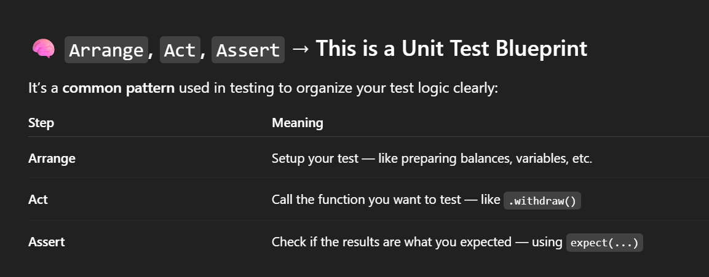
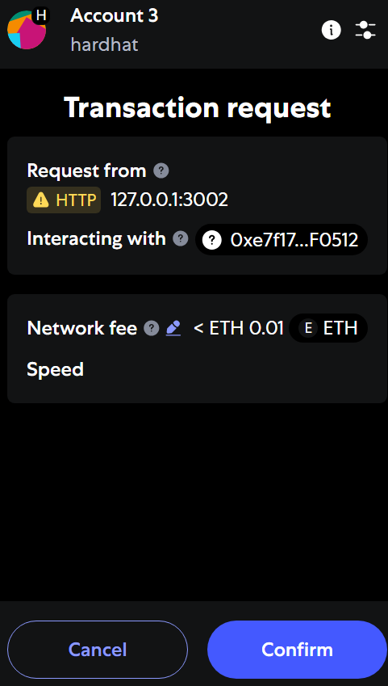
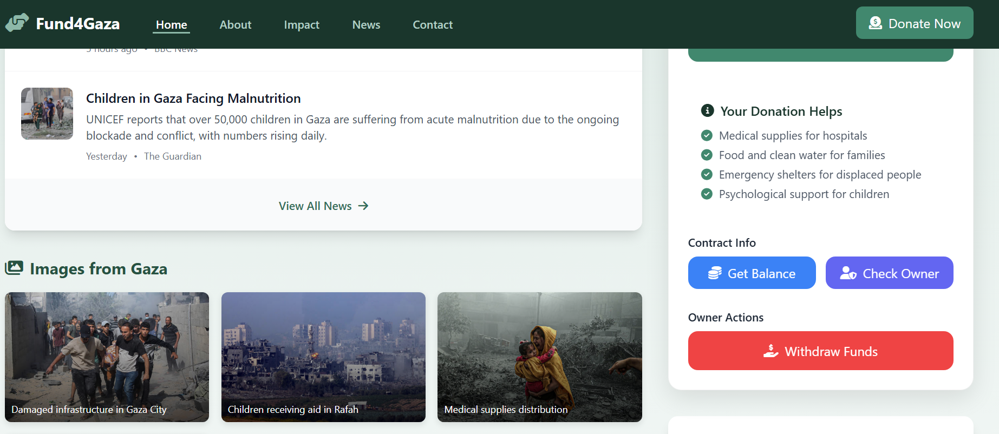
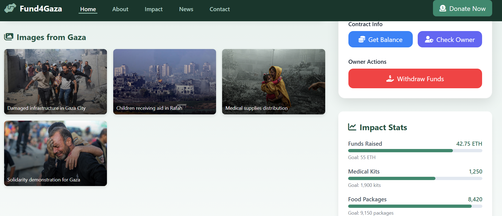
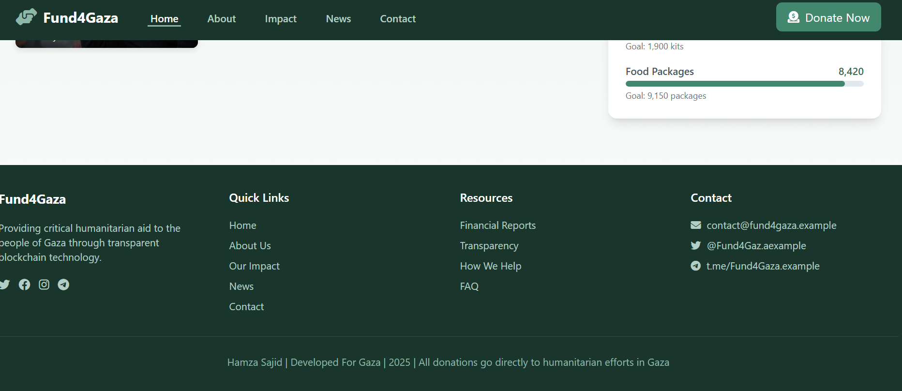
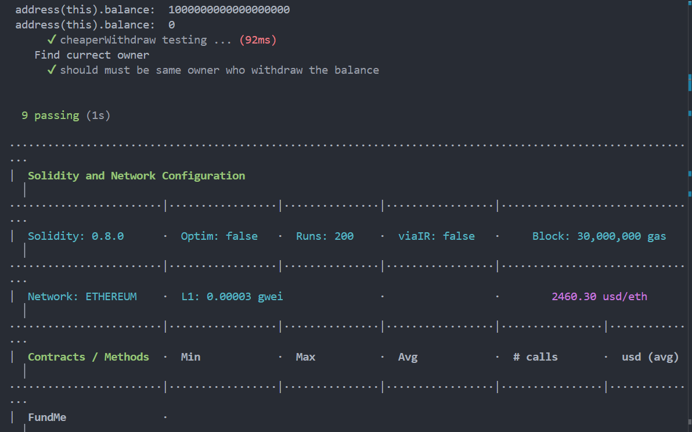

# FundMe Smart Contract Project

This project is a decentralized crowdfunding (FundMe) DApp built with Solidity and Hardhat, designed to support humanitarian causes such as relief for Gaza. It allows anyone to contribute ETH, tracks all funders, and enables the contract owner to withdraw funds. The project leverages Chainlink price feeds for real-time ETH/USD conversion and is fully tested and verified on the Sepolia testnet.

## Project Details

### Purpose
A blockchain-based crowdfunding platform for Gaza, where people can fund the cause transparently. Only the owner (project organizer) can withdraw the collected funds, ensuring security and accountability.

### How It Works
- **Funding:** Anyone can send ETH to the contract using the `fund` function. The contract checks the minimum USD value using Chainlink price feeds.
- **Tracking:** All funders and their contributions are tracked on-chain.
- **Withdrawal:** Only the contract owner can withdraw the total funds using the `withdraw` function.
- **Transparency:** All transactions are visible on the blockchain, and the contract is verified on Etherscan.

### Technologies Used
- **Solidity:** Smart contract language
- **Hardhat:** Development environment and testing framework
- **hardhat-deploy:** Automated deployment scripts
- **ethers.js:** Interact with Ethereum blockchain from JavaScript
- **Chainlink:** Decentralized price feeds for ETH/USD
- **Mocha & Chai:** Unit and staging testing
- **Solhint:** Solidity linter for code quality
- **solidity-coverage:** Code coverage for smart contracts
- **dotenv:** Manage environment variables

## Project Structure
```
hardhat-fund-me/
├── contracts/           # Solidity smart contracts
│   └── FundMe.sol
├── coverage/            # Coverage reports
├── deploy/              # Deployment scripts
│   ├── 00-deploy-mocks.js
│   └── 01-deploy-fundMe.js
├── deployments/         # Deployment artifacts
├── frontend/            # Frontend code (HTML/Tailwind CSS/JS)
├── ignition/            # Hardhat Ignition modules
├── node_modules/        # Node.js dependencies
├── script/              # Custom scripts (fund, withdraw, etc.)
│   ├── deployerBalance.js
│   ├── fund.js
│   └── withdraw.js
├── test/                # Unit and staging tests
│   └── staging/
│       └── FuneMe.staging.js
├── hardhat.config.js    # Hardhat configuration
├── helper-hardhat-config.js
├── utils/               # Utility scripts (e.g., contract verification)
├── .env                 # Environment variables
└── README.md            # Project documentation
```

## Getting Started

### Prerequisites
- Node.js (v18+ recommended)
- npm or yarn
- [Hardhat](https://hardhat.org/)

### Installation
1. Clone the repository:
   ```bash
   git clone <repo-url>
   cd hardhat-fund-me
   ```
2. Install dependencies:
   ```bash
   npm install
   # or
   yarn install
   ```

### Environment Variables
Create a `.env` file in the root directory and add:
```
INFURA_URL=your_infura_url
PRIVATE_KEY=your_private_key
COINMARKETCAP_API_KEY=your_coinmarketcap_api_key
ETHERSCAN_API_KEY=your_etherscan_api_key
```

> **Note:** This project uses [Chainlink](https://chain.link/) decentralized price feeds to ensure accurate ETH/USD conversion for minimum funding requirements. Make sure your network supports Chainlink or mocks are deployed for local testing.

## Deployment
To deploy the contract to Sepolia:
```bash
npx hardhat deploy --network sepolia
```

## Verification
After deployment, the contract is automatically verified on Etherscan if the API key is set.

## Testing
- **Unit Tests:**
  ```bash
  npx hardhat test
  ```
- **Staging Tests:**
  ```bash
  npx hardhat test --network sepolia
  ```

## Interacting with the Contract
- Get contract address and ABI from Hardhat Deploy:
  ```js
  const FundMe = await deployments.get("FundMe");
  ```
- Use ethers.js or web3.js in your frontend to interact with the contract.

## Frontend
You can add your frontend code in the `frontend/` directory. Use JavaScript libraries like ethers.js or web3.js to connect to the deployed contract.

## Screenshots
Below are improved and organized screenshots of the DApp and its features:

#### Main Dashboard


#### Funding Page


#### Transaction Page


#### Transaction Proof


#### Web View


#### Footer


#### Withdraw


#### Additional UI


#### Hardhat Node Transaction


#### Unit Test and Gas Report


- [Verified Contract on Etherscan](https://sepolia.etherscan.io/address/0xd1ffeCD2602326350298F2CCfd7e5E86D65B4F62#code)
- [Chainlink Documentation](https://docs.chain.link/)
- [Hardhat Documentation](https://hardhat.org/docs)

---

Feel free to contribute or open issues for improvements!